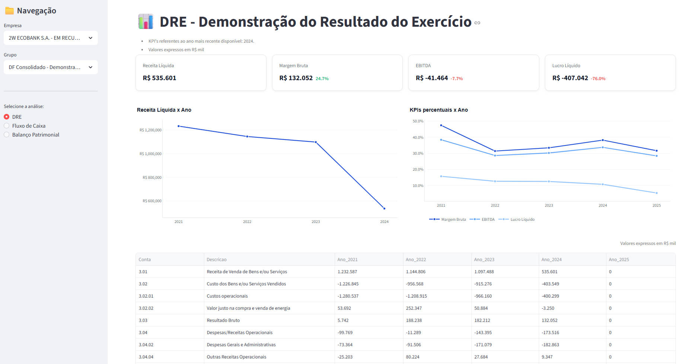

# 📊 Análise de Companhias CVM

Dashboard interativo para análise de demonstrações financeiras de empresas de capital aberto listadas na **CVM (Comissão de Valores Mobiliários)**.

O projeto coleta dados públicos disponibilizados pela CVM, valida, transforma e carrega em um banco SQLite local, disponibilizando visualizações interativas via Streamlit.

---

## 🎯 Objetivo

Oferecer uma plataforma gratuita, visual e interativa para análise da saúde financeira de empresas listadas na bolsa de valores brasileira, algo que ferramentas comerciais cobram e que, com dados públicos, pode ser feito de forma acessível.

---

## 🏗️ Arquitetura

```
[ CVM - Dados Públicos (CSV) ]
          ↓
[ Coleta (requests) ]
          ↓
[ Validação (Pydantic) ]
          ↓
[ Transformação (Pandas) ]
          ↓
[ Data Warehouse (SQLite + SQLAlchemy) ]
          ↓
[ Dashboard (Streamlit) ]
```

---

## 🛠️ Stack

| Tecnologia   | Versão       | Uso                                  |
|--------------|--------------|---------------------------------------|
| Python       | 3.12.1       | Linguagem base                        |
| Streamlit    | ≥ 1.57.0     | Interface do dashboard                |
| Pandas       | ≥ 3.0.2      | Manipulação e transformação de dados  |
| SQLAlchemy   | ≥ 2.0.49     | ORM e conexão com SQLite              |
| Pydantic     | ≥ 2.13.2     | Validação de schema dos dados         |
| Plotly       | —            | Gráficos interativos                  |
| Requests     | ≥ 2.33.1     | Download dos arquivos da CVM          |
| OpenPyXL     | ≥ 3.1.5      | Leitura de arquivos Excel             |
| NumPy        | ≥ 2.4.4      | Suporte a operações numéricas         |

Gerenciador de pacotes: **Poetry**

---

## 📁 Estrutura do Projeto

```
analise_companhias_cvm/
│
├── src/
│   ├── ingestion/          # Download dos CSVs da CVM
│   ├── schema/             # Definição dos schemas
│   ├── validator/          # Validação com Pydantic
│   ├── transformation/     # Limpeza e transformação dos dados
│   ├── database/           # Configuração do banco SQLite
│   ├── models/             # Modelos de tabelas (SQLAlchemy)
│   ├── load/               # Carga dos dados no banco
│   ├── queries_dre.py      # Queries da DRE
│   └── utils/
│       ├── components.py   # Componentes reutilizáveis (cards, gráficos)
│       └── formatters.py   # Formatadores de valores (BRL, %)
│
├── data/
│   ├── raw/                # CSVs baixados da CVM (gerado automaticamente)
│   └── clean/              # Dados após transformação (gerado automaticamente)
│
├── app.py                  # Ponto de entrada do Streamlit
├── pyproject.toml          # Dependências e configuração do Poetry
├── poetry.lock             # Lock file das dependências
├── .python-version         # Versão do Python (3.12.1)
├── prd.md                  # Product Requirement Document
└── .gitignore
```

---

## ⚙️ Como Rodar Localmente

### Pré-requisitos

- [Python 3.12+](https://www.python.org/downloads/)
- [Poetry](https://python-poetry.org/docs/#installation)

### 1. Clone o repositório

```bash
git clone https://github.com/WesleyPenteado/analise_companhias_cvm.git
cd analise_companhias_cvm
```

### 2. Instale as dependências

```bash
poetry install
```

### 3. Ative o ambiente virtual via comando bash

```bash
poetry shell
```

ou
```bash
source .venv/Scripts/activate
```

### 4. Execute a ingestão de dados

> Este passo baixa os arquivos da CVM, valida, transforma e popula o banco SQLite local.

```bash
python -m src.main
```

> Os diretórios `data/raw/` e `data/clean/` serão criados automaticamente. O banco `cvm.db` será gerado na raiz do projeto.

### 5. Inicie o dashboard

```bash
streamlit run app.py
```

Acesse em: [http://localhost:8501](http://localhost:8501)

---

## 📈 Funcionalidades

### ✅ Implementado

**DRE — Demonstração do Resultado do Exercício**
- Filtro por empresa e tipo de demonstração (Consolidada ou individual)
- KPIs: Receita Líquida, Margem Bruta, EBITDA e Lucro Líquido
- Análise de tendência para cada KPI
- Tabela completa da DRE para análisar detalhadamente cada conta

**Resultado Dashboard Streamlit**


### 🚧 Em Desenvolvimento

- **Análise de Fluxo de Caixa (DFC)** — estrutura criada, relatório em construção
- **Análise de Balanço Patrimonial (BP)** — estrutura criada, relatório em construção

---

## 🗂️ Fonte dos Dados

Os dados são obtidos diretamente do portal de dados abertos da CVM:

🔗 [https://dados.cvm.gov.br](https://dados.cvm.gov.br)

Arquivos utilizados: demonstrações financeiras padronizadas (DFP/ITR) no formato CSV.

> Os dados são públicos e de uso livre, conforme a legislação brasileira.

---

## ⚠️ Fora de Escopo

- Machine Learning e previsão financeira
- Dados em tempo real
- Integração com APIs de corretoras

---

## 👤 Autor

**Wesley Penteado**
- GitHub: [@WesleyPenteado](https://github.com/WesleyPenteado)
- Linkedin: [@wesleypenteadocosta](https://www.linkedin.com/in/wesleypenteadocosta/)
- Email: wesleycosta.ne@gmail.com
